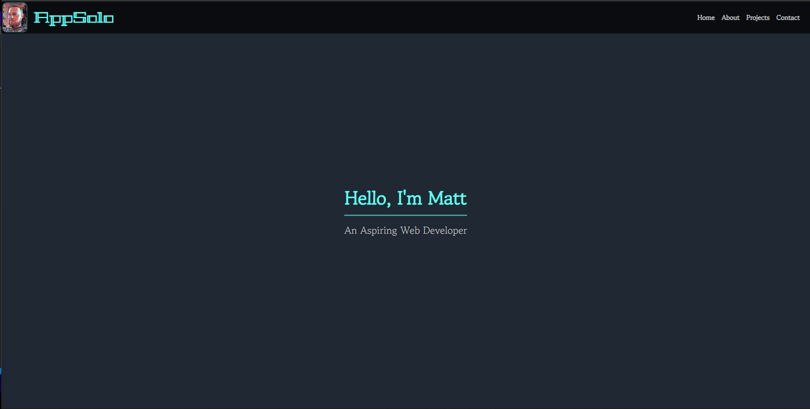
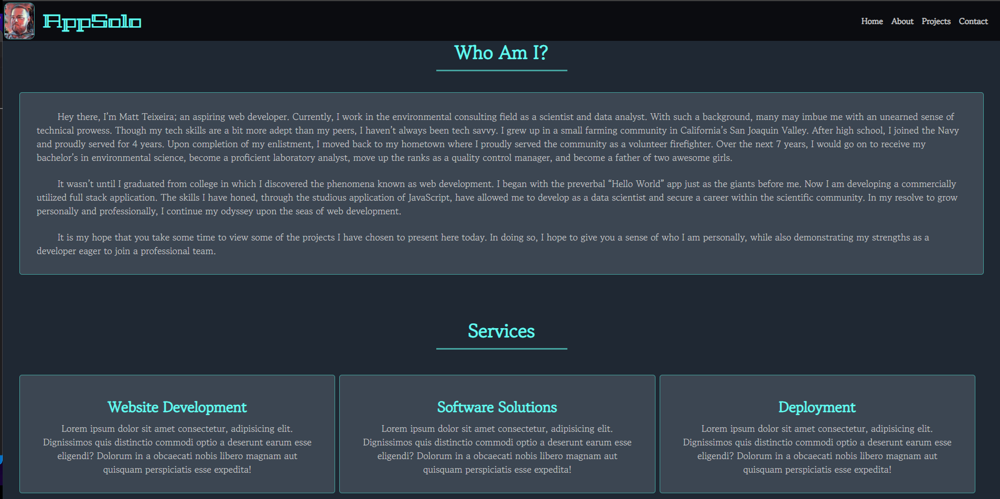
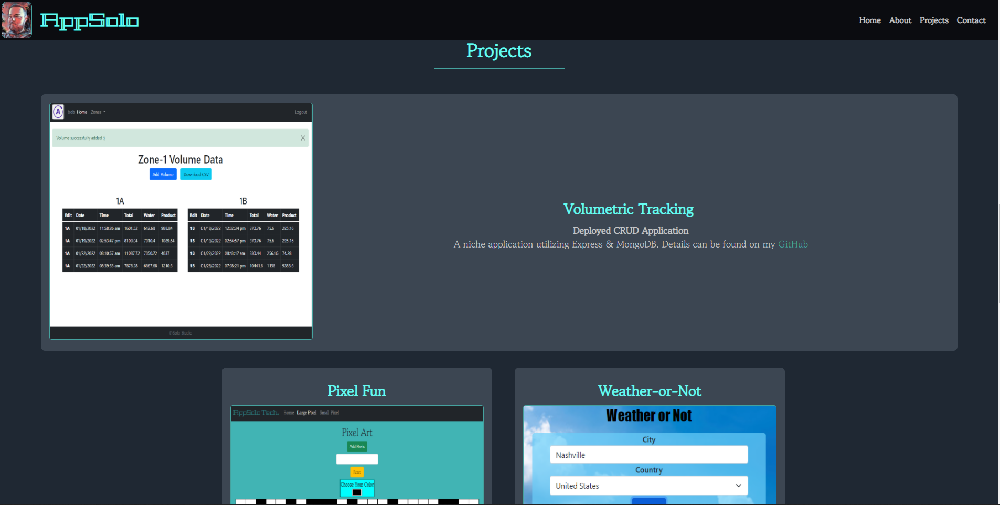
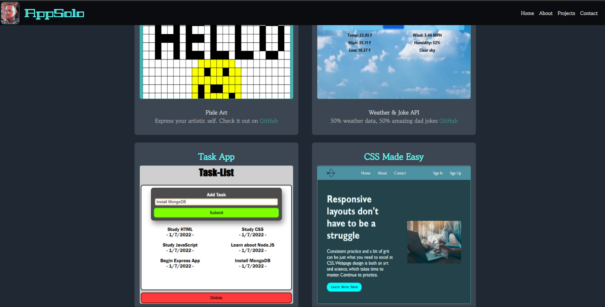
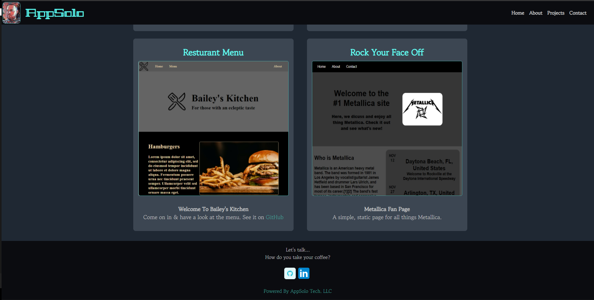

# Portfolio
Hey there, I’m Matt Teixeira; an aspiring web developer. Currently, I work in the environmental consulting field as a scientist and data analyst. With such a background, many may imbue me with an unearned sense of technical prowess. Though my tech skills are a bit more adept than my peers, I haven’t always been tech savvy. I grew up in a small farming community in California’s San Joaquin Valley. After high school, I joined the Navy and proudly served for 4 years. Upon completion of my enlistment, I moved back to my hometown where I proudly served the community as a volunteer firefighter. Over the next 7 years, I would go on to receive my bachelor’s in environmental science, become a proficient laboratory analyst, move up the ranks as a quality control manager, and become a father of two awesome girls.

It wasn’t until I graduated from college in which I discovered the phenomena known as web development. I began with the preverbal “Hello World” app just as the giants before me. Now I am developing a commercially utilized full stack application. The skills I have honed, through the studious application of JavaScript, have allowed me to develop as a data scientist and secure a career within the scientific community. In my resolve to grow personally and professionally, I continue my odyssey upon the seas of web development.

It is my hope that you take some time to view some of the projects I have chosen to present here today. In doing so, I hope to give you a sense of who I am personally, while also demonstrating my strengths as a developer eager to join a professional team.

Please utilize the following link to view this project’s associated page: [Portfolio](https://apollosolo.github.io/Portfolio/)

Thank you!

